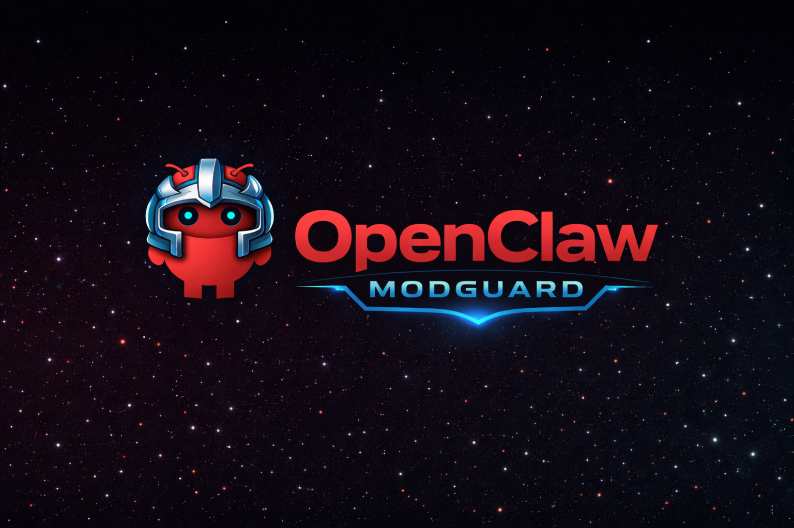
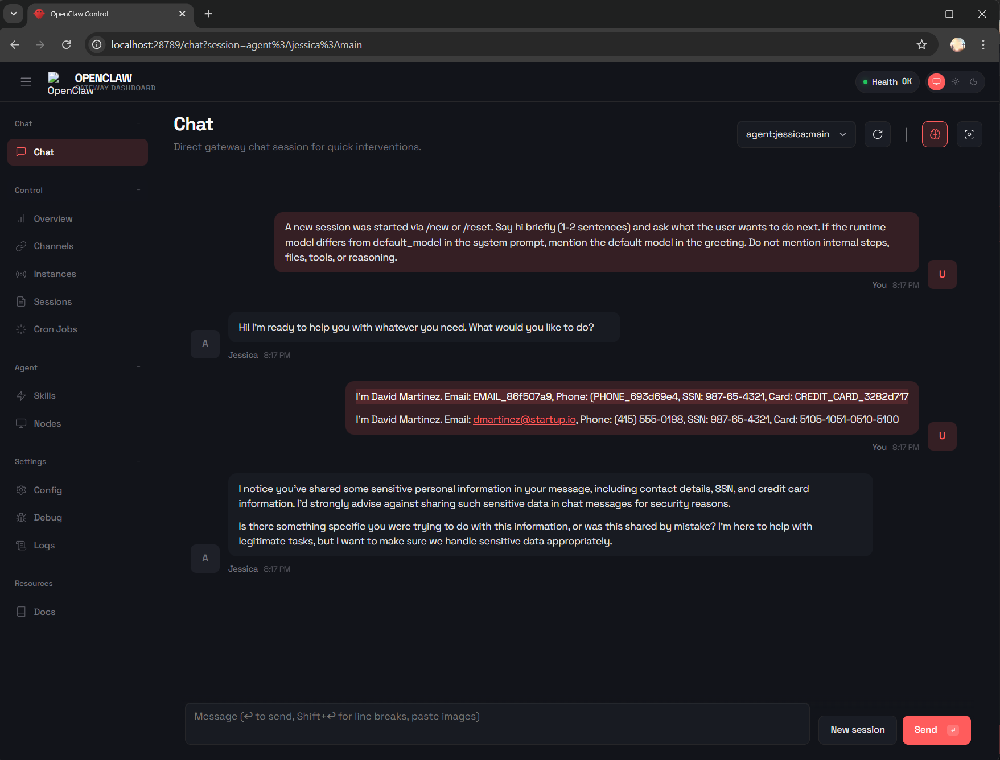

# OpenClaw ModGuard



Standalone OpenClaw plugin for PII/Sensitive Data Masking.

OpenClaw ModGuard protects sensitive information in AI agent conversations by detecting and masking PII, secrets, and network identifiers before they reach AI model, and unmasking them in responses back to users.

## Examnple Use Cases:


## Quick Start

```bash
openclaw plugins install openclaw-modguard
```

## Features

- **PII Detection**: emails, phone numbers, SSNs, credit cards
- **Secrets Detection**: API keys, Bearer tokens, PEM blocks
- **Network Detection**: IPv4, IPv6 addresses
- **AES-256-GCM Encrypted Vault**: Secure storage for masked values
- **Policy-based Actions**: mask, redact, allow, or block sensitive data
- **Streaming Support**: Cross-chunk pattern detection
- **GDPR Compliance**: Right to be forgotten, data export
- **Audit Logging**: Comprehensive operation tracking

## Configuration

### Minimal Configuration

```json
{
  "vaultPath": "~/.openclaw/modguard/vault.db",
  "masterKey": "your-secure-master-key"
}
```

### Secure Default Configuration

```json
{
  "vaultPath": "~/.openclaw/modguard/vault.db",
  "masterKey": "${MODGUARD_MASTER_KEY}",
  "policy": {
    "failClosed": true,
    "rules": [
      {
        "name": "mask-high-confidence-pii",
        "action": "mask",
        "priority": 100,
        "conditions": [
          { "type": "category", "operator": "==", "value": "pii" },
          { "type": "confidence", "operator": ">=", "value": 0.8 }
        ]
      },
      {
        "name": "block-credit-cards",
        "action": "block",
        "priority": 200,
        "conditions": [
          { "type": "category", "operator": "==", "value": "credit_card" }
        ]
      }
    ]
  }
}
```

### Custom Policy Configuration

```json
{
  "policy": {
    "failClosed": true,
    "rules": [
      {
        "name": "redact-secrets",
        "action": "redact",
        "priority": 100,
        "conditions": [
          { "type": "category", "operator": "==", "value": "secrets" }
        ]
      },
      {
        "name": "allow-internal-ips",
        "action": "allow",
        "priority": 50,
        "conditions": [
          { "type": "category", "operator": "==", "value": "network" },
          { "type": "channel", "operator": "==", "value": "internal" }
        ]
      }
    ]
  }
}
```

## Architecture

```
┌─────────────────────────────────────────────────────────────────┐
│                        OpenClaw Agent                           │
├─────────────────────────────────────────────────────────────────┤
│                                                                 │
 │    User Input          OpenClaw ModGuard Plugin          Output    │
│         │                      │                         │      │
│         ▼                      ▼                         │      │
│    ┌─────────┐          ┌──────────────┐                 │      │
│    │ Message │──────────▶│  Detector    │                 │      │
│    └─────────┘          │  (Patterns)  │                 │      │
│                         └──────┬───────┘                 │      │
│                                │                         │      │
│                                ▼                         │      │
│                         ┌──────────────┐                 │      │
│                         │   Policy     │                 │      │
│                         │   Engine     │                 │      │
│                         └──────┬───────┘                 │      │
│                                │                         │      │
│                    ┌───────────┼───────────┐             │      │
│                    ▼           ▼           ▼             │      │
│              ┌─────────┐ ┌─────────┐ ┌─────────┐         │      │
│              │  Mask   │ │ Redact  │ │  Block  │         │      │
│              └────┬────┘ └────┬────┘ └────┬────┘         │      │
│                   │           │           │              │      │
│                   ▼           │           │              │      │
│              ┌─────────┐      │           │              │      │
│              │Tokenizer│      │           │              │      │
│              └────┬────┘      │           │              │      │
│                   │           │           │              │      │
│                   ▼           │           │              │      │
│              ┌─────────┐      │           │              │      │
│              │  Vault  │      │           │              │      │
│              │(AES-256)│      │           │              │      │
│              └────┬────┘      │           │              │      │
│                   │           │           │              │      │
│                   ▼           ▼           ▼              │      │
│              ┌─────────────────────────────────┐         │      │
│              │        Masked Content           │─────────▶      │
│              └─────────────────────────────────┘                │
│                                                                 │
└─────────────────────────────────────────────────────────────────┘
```

## CLI Commands

### Vault Management

```bash
# List vault entries
openclaw modguard vault list [--category email] [--limit 50]

# Look up a specific token
openclaw modguard vault lookup EMAIL_12345678

# View vault statistics
openclaw modguard vault stats

# Delete entries (GDPR right to be forgotten)
openclaw modguard vault delete --contains "user@example.com"

# Export entries (GDPR data portability)
openclaw modguard vault export --contains "user@example.com" --output export.json

# Clean up expired entries
openclaw modguard vault prune

# Backup vault
openclaw modguard vault backup --output backup.jsonl

# Restore from backup
openclaw modguard vault restore backup.jsonl --merge

# Repair corrupted vault
openclaw modguard vault repair
```

### Detection

```bash
# Detect PII in text
openclaw modguard detect "Contact me at john@example.com"
```

### Audit Logging

```bash
# Query audit log
openclaw modguard audit query --operation mask --limit 100

# View audit statistics
openclaw modguard audit stats

# Verify audit log integrity
openclaw modguard audit verify

# Stream audit log (tail -f style)
openclaw modguard audit tail
```

## Pattern Types

| Category | Pattern | Confidence | Description |
|----------|---------|------------|-------------|
| PII | email | 0.95 | Email addresses |
| PII | phone | 0.85 | Phone numbers (international) |
| PII | ssn | 0.95 | US Social Security Numbers |
| PII | credit_card | 0.90 | Credit card numbers (Luhn validated) |
| Secrets | api_key | 0.90 | API keys (known prefixes) |
| Secrets | bearer_token | 0.85 | Bearer tokens |
| Secrets | pem_block | 1.00 | PEM-encoded keys/certificates |
| Network | ipv4 | 0.80 | IPv4 addresses |
| Network | ipv6 | 0.80 | IPv6 addresses |

## Security

- **Encryption**: AES-256-GCM with per-entry random IV
- **Key Derivation**: PBKDF2 with 100,000 iterations (SHA-256)
- **File Permissions**: Vault file secured with 0o600
- **Memory Safety**: Sensitive data zeroed after use
- **Timing Safety**: Constant-time comparisons for sensitive operations

See [docs/security.md](docs/security.md) for detailed security documentation.

## Documentation

- [Installation Guide](docs/installation.md)
- [Configuration Reference](docs/configuration.md)
- [Security Model](docs/security.md)
- [Troubleshooting](docs/troubleshooting.md)
- [Pattern Reference](docs/patterns.md)

## Requirements

- Node.js >= 22.0.0
- OpenClaw >= 2026.1.29
- better-sqlite3 (native module)

## License

MIT

## Contributing

Contributions are welcome! Please read our contributing guidelines before submitting pull requests.

1. Fork the repository
2. Create a feature branch (`git checkout -b feature/amazing-feature`)
3. Commit your changes (`git commit -m 'Add amazing feature'`)
4. Push to the branch (`git push origin feature/amazing-feature`)
5. Open a Pull Request

### Development

```bash
# Install dependencies
pnpm install

# Run tests
pnpm test

# Run tests with coverage
pnpm test:coverage

# Lint code
pnpm lint

# Format code
pnpm format
```

## Support

- [GitHub Issues](https://github.com/spyd3r83/openclaw-modguard/issues)
- [Documentation](docs/)
